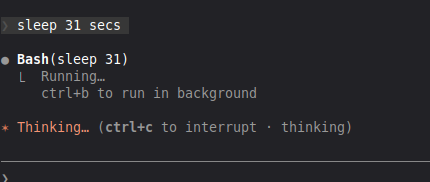
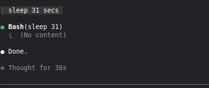
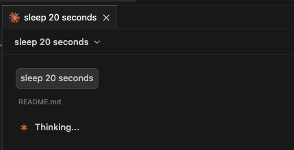

# claude-depester

[](https://www.npmjs.com/package/claude-depester)
[](https://www.npmjs.com/package/claude-depester)
[](https://opensource.org/licenses/MIT)

Patches Claude Code CLI and VS Code extension to replace whimsical loading words with simple 'Thinking'.

Instead of seeing "Flibbertigibbeting", "Discombobulating", "Clauding", etc., you'll see a clean "Thinking".

> **Last updated:** 2026-01-28 | **Tested with:** Claude Code 2.1.15 | **Platforms:** Linux, macOS, Windows
>
> v1.3.6: Add support for VS Code Remote SSH and Cursor Remote SSH (`.vscode-server`, `.cursor-server`)

**CLI - Spinner:**



**CLI - Completion:**



**VS Code Extension:**



## The Problem

Claude Code displays random silly words while thinking:

```
Flibbertigibbeting...
Discombobulating...
Smooshing...
Wibbling...
Clauding...
```

And after thinking completes, it shows completion messages like:

```
Baked for 42s
Brewed for 15s
Churned for 30s
```

This tool replaces them with simple "Thinking" and "Thought for Xs".

## Quick Start

```bash
# Preview changes first (recommended)
npx claude-depester --dry-run

# Patch Claude Code
npx claude-depester
```

Restart Claude Code for changes to take effect.

### Auto-patch after updates (recommended)

Add a shell wrapper that patches before each invocation:

```bash
# Add to your .bashrc or .zshrc
cl() { npx claude-depester --all --silent --log ; claude "$@" ; }
```

Then use `cl` instead of `claude`. This ensures patching happens *before* Claude loads.

## Features

- **Patches spinner words** ("Flibbertigibbeting..." -> "Thinking...")
- **Patches completion verbs** ("Baked for 42s" -> "Thought for 42s")
- Works with native binaries (Bun-compiled) and npm installations
- **Patches VS Code/VSCodium extension webview** (the UI that shows spinner text)
- **Supports remote development** (VS Code Remote SSH, Cursor SSH)
- Auto-detects your Claude Code installation
- Creates backup before patching (can restore anytime)
- Shell wrapper for reliable auto-patching before Claude loads
- Content-based detection survives version updates
- Cross-platform: Linux, macOS, Windows (WSL/Git Bash)

## Commands

| Command | Description |
|---------|-------------|
| `npx claude-depester` | Patch Claude Code |
| `npx claude-depester --all` | Patch ALL installations (CLI + VS Code) |
| `npx claude-depester --list` | List all found installations |
| `npx claude-depester --dry-run` | Preview changes (no modifications) |
| `npx claude-depester --check` | Check patch status |
| `npx claude-depester --restore` | Restore original from backup |
| `npx claude-depester --verbose` | Show detailed info |
| `npx claude-depester --debug` | Show detailed debug info (for troubleshooting) |
| `npx claude-depester --log` | Write results to `~/.claude/depester.log` |
| `npx claude-depester --install-hook` | Auto-patch after updates |
| `npx claude-depester --remove-hook` | Remove auto-patch hook |
| `npx claude-depester --hook-status` | Check hook status |
| `npx claude-depester --help` | Show help |

## Supported Installation Methods

### Linux
| Method | Path | Status |
|--------|------|--------|
| Native binary | `~/.local/share/claude/versions/X.Y.Z` | Fully supported |
| VS Code extension | `~/.vscode/extensions/anthropic.claude-code-*/` | Fully supported |
| VS Code webview | `~/.vscode/extensions/.../webview/index.js` | Fully supported |
| VSCodium extension | `~/.vscode-oss/extensions/anthropic.claude-code-*/` | Fully supported |
| VS Code Remote (SSH) | `~/.vscode-server/extensions/anthropic.claude-code-*/` | Fully supported |
| Cursor Remote (SSH) | `~/.cursor-server/extensions/anthropic.claude-code-*/` | Fully supported |
| Local npm | `~/.claude/local/node_modules/@anthropic-ai/claude-code/` | Fully supported |
| Global npm | `npm root -g`/@anthropic-ai/claude-code/ | Fully supported |

### macOS
| Method | Path | Status |
|--------|------|--------|
| Native binary | `~/.local/share/claude/versions/X.Y.Z` | Fully supported |
| Native binary | `~/Library/Application Support/Claude/versions/X.Y.Z` | Fully supported |
| VS Code extension | `~/.vscode/extensions/anthropic.claude-code-*/` | Fully supported |
| VS Code webview | `~/.vscode/extensions/.../webview/index.js` | Fully supported |
| Homebrew | `/opt/homebrew/lib/node_modules/@anthropic-ai/claude-code/` | Fully supported |

### Windows (WSL/Git Bash)
| Method | Path | Status |
|--------|------|--------|
| Native binary | `%USERPROFILE%\.local\bin\claude.exe` | Fully supported |
| Native binary | `%LOCALAPPDATA%\Claude\versions\X.Y.Z` | Fully supported |
| VS Code extension | `%USERPROFILE%\.vscode\extensions\anthropic.claude-code-*\` | Fully supported |
| VS Code webview | `...\extensions\...\webview\index.js` | Fully supported |

The tool auto-detects your installation. Use `--list` to see all found installations, and `--all` to patch them all at once.

> **Important for VS Code users:** The extension has TWO places with spinner words - the native binary AND the webview. Use `--all` to patch both!

> **Remote Development (SSH):** When using VS Code Remote or Cursor over SSH, run the tool **on the remote server** to patch `~/.vscode-server` or `~/.cursor-server`.

## After Claude Code Updates

If you're using the shell wrapper (recommended), patching happens automatically before each session.

Otherwise, just run `npx claude-depester` again after updating.

## Restore Original

```bash
npx claude-depester --restore
```

This restores from the backup created during patching.

## SessionStart Hook (Alternative)

> **Note:** The shell wrapper is the recommended approach. The SessionStart hook has a limitation: it runs *after* Claude is already loaded into memory, so the patch only takes effect on the *next* session after an update.

The `--install-hook` command adds a SessionStart hook to `~/.claude/settings.json`:

```json
{
  "hooks": {
    "SessionStart": [
      {
        "hooks": [
          {
            "type": "command",
            "command": "npx claude-depester --all --silent --log"
          }
        ]
      }
    ]
  }
}
```

This patches the file on disk at session start, but the current session may still show silly words until you restart. The `--log` flag writes results to `~/.claude/depester.log` (keeps last 50 entries) for troubleshooting.

To install or update the hook:
```bash
npx claude-depester --install-hook
> ```

## Troubleshooting

### Still seeing silly words after patching?

**You must fully restart Claude Code / VS Code / VSCodium** after patching. The patch modifies the binary on disk, but running processes still use the old code in memory.

For VS Code / VSCodium:
1. Close the editor completely (check it's not running in background)
2. Kill any remaining processes: `pkill -f codium` or `pkill -f "Code"`
3. Reopen the editor

To verify processes are stopped:
```bash
ps aux | grep -E "(vscode|codium|claude)" | grep -v grep
```

### "Could not find Claude Code installation"

Make sure Claude Code is installed:
- Check with `claude --version`
- Run with `--verbose` to see searched paths
- Use `--list` to see all detected installations

### VS Code extension still showing silly words

The VS Code extension has **TWO separate components** with spinner words:
1. **Native binary** (`resources/native-binary/claude`) - the backend
2. **Webview** (`webview/index.js`) - the frontend UI that renders the spinner

You must patch BOTH for the fix to work. Use:
```bash
npx claude-depester --list    # Should show both binary AND webview
npx claude-depester --all     # Patch ALL components
```

Then **fully restart VS Code** (not just reload window).

### Patch not working after update

The detection uses content-based matching, so it should survive version updates.
If the patch fails:
1. Run `npx claude-depester --debug` to see detailed diagnostics
2. Open an issue with your Claude Code version (`claude --version`)
3. Include the output of `npx claude-depester --debug`

### Want to undo everything

```bash
npx claude-depester --restore --all  # Restore all installations
npx claude-depester --remove-hook    # Remove hook (if installed)
# Remove the shell wrapper from your .bashrc/.zshrc if added
```

## Technical Details

### How it works

1. **Detection**: Finds the silly words arrays by unique content markers (e.g., "Flibbertigibbeting", "Discombobulating") rather than variable names (which change every version due to minification)

2. **Extraction**: For native binaries (Bun-compiled), uses [node-lief](https://www.npmjs.com/package/node-lief) to properly extract the embedded JavaScript - the same approach used by [tweakcc](https://github.com/Piebald-AI/tweakcc)

3. **Patching**: Replaces two arrays:
   - Spinner words: `["Accomplishing",...,"Zigzagging"]` -> `["Thinking"]`
   - Completion verbs: `["Baked",...,"Worked"]` -> `["Thought"]`

4. **Repacking**: Rebuilds the binary with the modified JavaScript

### File locations

- **Backup**: `<original-file>.depester.backup`
- **Hook config**: `~/.claude/settings.json`
- **Debug log**: `~/.claude/depester.log` (when using `--log`)

## Requirements

- Node.js >= 18.0.0
- Claude Code installed

## Platform Support

| Platform | Binary Patching | Webview Patching | Status |
|----------|-----------------|------------------|--------|
| Linux x64 | ELF | Yes | Tested |
| Linux ARM64 | ELF | Yes | Should work |
| macOS Intel | MachO | Yes | Should work |
| macOS Apple Silicon | MachO | Yes | Should work |
| Windows x64 | PE | Yes | Should work |
| Windows ARM64 | PE | Yes | Should work |

The tool uses [node-lief](https://www.npmjs.com/package/node-lief) which has prebuilt binaries for all these platforms.

## Contributing

If Claude Code updates and the patch stops working:

1. Check if the array still contains marker words like `"Flibbertigibbeting"`
2. Update `lib/patcher.js` if the pattern changed
3. Submit a PR

Issues and PRs welcome!

## Related Projects

- [tweakcc](https://github.com/Piebald-AI/tweakcc) - Full Claude Code customization (themes, prompts, and more)
- [claude-code-thinking-patch](https://github.com/aleks-apostle/claude-code-thinking-patch) - Thinking visibility patch

## Acknowledgments

This project builds upon work by:
- [tweakcc](https://github.com/Piebald-AI/tweakcc) - For the proper Bun binary extraction/repacking approach
- [vemv's gist](https://gist.github.com/vemv/c6333d53ede16198a23eb95425051b7b) - Original simple patch idea
- [heromantf's bun extractor](https://gist.github.com/heromantf/7db88edcb7b1c0c35067244584a01afc) - Bun binary structure documentation

## Donors

Thanks to these generous supporters:

- [@gyohng](https://github.com/gyohng)

## License

MIT - see [LICENSE](LICENSE)

---

## Appendix: Full List of Silly Words

### Spinner Words (184 words)

These are displayed while Claude is thinking. This tool replaces all of them with "Thinking":

> Accomplishing, Actioning, Actualizing, Architecting, Baking, Beaming, Beboppin', Befuddling, Billowing, Blanching, Bloviating, Boogieing, Boondoggling, Booping, Bootstrapping, Brewing, Burrowing, Calculating, Canoodling, Caramelizing, Cascading, Catapulting, Cerebrating, Channeling, Channelling, Choreographing, Churning, Clauding, Coalescing, Cogitating, Combobulating, Composing, Computing, Concocting, Considering, Contemplating, Cooking, Crafting, Creating, Crunching, Crystallizing, Cultivating, Deciphering, Deliberating, Determining, Dilly-dallying, Discombobulating, Doing, Doodling, Drizzling, Ebbing, Effecting, Elucidating, Embellishing, Enchanting, Envisioning, Evaporating, Fermenting, Fiddle-faddling, Finagling, Flambeing, Flibbertigibbeting, Flowing, Flummoxing, Fluttering, Forging, Forming, Frolicking, Frosting, Gallivanting, Galloping, Garnishing, Generating, Germinating, Gitifying, Grooving, Gusting, Harmonizing, Hashing, Hatching, Herding, Honking, Hullaballooing, Hyperspacing, Ideating, Imagining, Improvising, Incubating, Inferring, Infusing, Ionizing, Jitterbugging, Julienning, Kneading, Leavening, Levitating, Lollygagging, Manifesting, Marinating, Meandering, Metamorphosing, Misting, Moonwalking, Moseying, Mulling, Mustering, Musing, Nebulizing, Nesting, Noodling, Nucleating, Orbiting, Orchestrating, Osmosing, Perambulating, Percolating, Perusing, Philosophising, Photosynthesizing, Pollinating, Pondering, Pontificating, Pouncing, Precipitating, Prestidigitating, Processing, Proofing, Propagating, Puttering, Puzzling, Quantumizing, Razzle-dazzling, Razzmatazzing, Recombobulating, Reticulating, Roosting, Ruminating, Sauteing, Scampering, Schlepping, Scurrying, Seasoning, Shenaniganing, Shimmying, Simmering, Skedaddling, Sketching, Slithering, Smooshing, Sock-hopping, Spelunking, Spinning, Sprouting, Stewing, Sublimating, Swirling, Swooping, Symbioting, Synthesizing, Tempering, Thinking, Thundering, Tinkering, Tomfoolering, Topsy-turvying, Transfiguring...

### Completion Verbs (8 words)

These are displayed after thinking completes (e.g., "Baked for 42s"). This tool replaces all of them with "Thought":

> Baked, Brewed, Churned, Cogitated, Cooked, Crunched, Sauteed, Worked

<sub>**Keywords:** claude code thinking words, claude code spinner, claude code flibbertigibbeting, claude code discombobulating, claude code clauding, claude code smooshing, claude code wibbling, anthropic claude code patch, remove silly words claude, claude code customization, claude code baked for, claude code completion verbs</sub>
