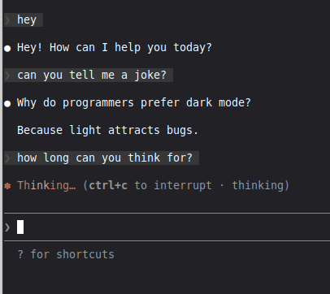

# claude-depester

[](https://www.npmjs.com/package/claude-depester)
[](https://opensource.org/licenses/MIT)

Remove silly thinking words from Claude Code.

Instead of seeing "Flibbertigibbeting", "Discombobulating", "Clauding", etc., you'll see a clean "Thinking".

> **Last updated:** 2026-01-11 | **Tested with:** Claude Code 2.1.4



## The Problem

Claude Code displays random silly words while thinking:

```
Flibbertigibbeting...
Discombobulating...
Smooshing...
```

This tool replaces them with a simple "Thinking".

## Quick Start

```bash
# Preview changes first (recommended)
npx claude-depester --dry-run

# Patch Claude Code
npx claude-depester

# Auto-patch after updates (recommended)
npx claude-depester --install-hook
```

That's it! Restart Claude Code for changes to take effect.

## Features

- Works with native binaries (Bun-compiled) and npm installations
- Auto-detects your Claude Code installation
- Creates backup before patching (can restore anytime)
- Optional SessionStart hook for auto-patching after updates
- Content-based detection survives version updates

## Commands

| Command | Description |
|---------|-------------|
| `npx claude-depester` | Patch Claude Code |
| `npx claude-depester --dry-run` | Preview changes (no modifications) |
| `npx claude-depester --check` | Check patch status |
| `npx claude-depester --restore` | Restore original from backup |
| `npx claude-depester --verbose` | Show detailed info |
| `npx claude-depester --install-hook` | Auto-patch after updates |
| `npx claude-depester --remove-hook` | Remove auto-patch hook |
| `npx claude-depester --hook-status` | Check hook status |
| `npx claude-depester --help` | Show help |

## Supported Installation Methods

| Method | Path | Status |
|--------|------|--------|
| Native binary | `~/.local/bin/claude` -> `~/.local/share/claude/versions/X.Y.Z` | Fully supported |
| Local npm | `~/.claude/local/node_modules/@anthropic-ai/claude-code/` | Fully supported |
| Global npm | `npm root -g`/@anthropic-ai/claude-code/ | Fully supported |
| Homebrew | `/opt/homebrew/Caskroom/claude-code/` | Fully supported |

The tool auto-detects your installation.

## After Claude Code Updates

With the hook installed (`--install-hook`), patching happens automatically on startup.

Otherwise, just run `npx claude-depester` again after updating.

## Restore Original

```bash
npx claude-depester --restore
```

This restores from the backup created during patching.

## How the Hook Works

The `--install-hook` command adds a SessionStart hook to `~/.claude/settings.json`:

```json
{
  "hooks": {
    "SessionStart": [
      {
        "hooks": [
          {
            "type": "command",
            "command": "npx claude-depester --silent"
          }
        ]
      }
    ]
  }
}
```

Every time Claude Code starts, it checks and re-applies the patch if needed.

## Troubleshooting

### "Could not find Claude Code installation"

Make sure Claude Code is installed:
- Check with `claude --version`
- Run with `--verbose` to see searched paths

### Patch not working after update

The detection uses content-based matching, so it should survive version updates.
If the patch fails:
1. Open an issue with your Claude Code version (`claude --version`)
2. Include the output of `npx claude-depester --dry-run --verbose`

### Want to undo everything

```bash
npx claude-depester --restore      # Restore original file
npx claude-depester --remove-hook  # Remove auto-patch hook
```

## Technical Details

### How it works

1. **Detection**: Finds the silly words array by unique content markers (e.g., "Flibbertigibbeting", "Discombobulating") rather than variable names (which change every version due to minification)

2. **Extraction**: For native binaries (Bun-compiled), uses [node-lief](https://www.npmjs.com/package/node-lief) to properly extract the embedded JavaScript - the same approach used by [tweakcc](https://github.com/Piebald-AI/tweakcc)

3. **Patching**: Replaces the array `["Accomplishing",...,"Zigzagging"]` with `["Thinking"]`

4. **Repacking**: Rebuilds the binary with the modified JavaScript

### File locations

- **Backup**: `<original-file>.depester.backup`
- **Hook config**: `~/.claude/settings.json`

## Requirements

- Node.js >= 18.0.0
- Claude Code installed

## Contributing

If Claude Code updates and the patch stops working:

1. Check if the array still contains marker words like `"Flibbertigibbeting"`
2. Update `lib/patcher.js` if the pattern changed
3. Submit a PR

Issues and PRs welcome!

## Related Projects

- [tweakcc](https://github.com/Piebald-AI/tweakcc) - Full Claude Code customization (themes, prompts, and more)
- [claude-code-thinking-patch](https://github.com/aleks-apostle/claude-code-thinking-patch) - Thinking visibility patch

## Acknowledgments

This project builds upon work by:
- [tweakcc](https://github.com/Piebald-AI/tweakcc) - For the proper Bun binary extraction/repacking approach
- [vemv's gist](https://gist.github.com/vemv/c6333d53ede16198a23eb95425051b7b) - Original simple patch idea
- [heromantf's bun extractor](https://gist.github.com/heromantf/7db88edcb7b1c0c35067244584a01afc) - Bun binary structure documentation

## License

MIT - see [LICENSE](LICENSE)
